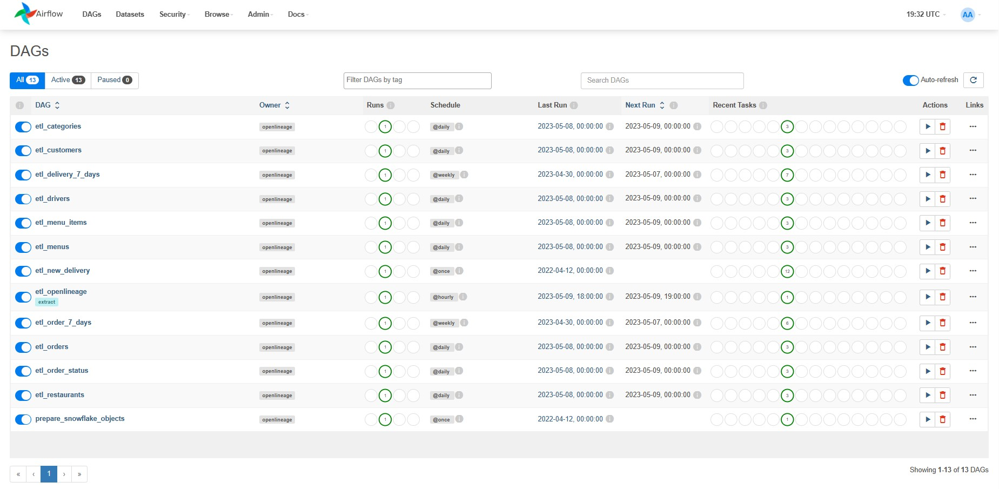
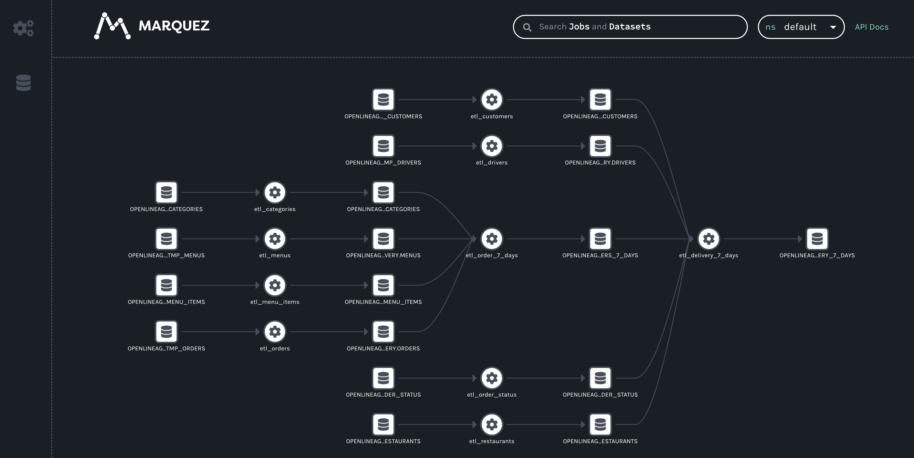

# Snowflake OpenLineage with Airflow Example

This example uses Airflow to run a collection of Snowflake queries for a fictional food delivery service. Lineage data for these queries is recorded within Snowflake [ACCESS_HISTORY](https://docs.snowflake.com/en/sql-reference/account-usage/access_history.html) and, using the OpenLineage Access History View, emitted to an OpenLineage backend.

This is done using a series of DAGs in `dags/etl` that each use SnowflakeOperator to run queries, along with a DAG in `dags/lineage` that uses PythonOperator to send generated OpenLineage events to the configured backend.

## Prerequisites

### Installing Marquez

First, check out the Marquez repository:
```bash
% git clone https://github.com/MarquezProject/marquez.git
% cd marquez
```

Then, run Marquez in detached mode:
```bash
% docker/up.sh -d
```

### Preparing Snowflake

In case you don't have Snowflake database dedicated for the demo you should create one and set it as `SNOWFLAKE_DB` environment variable.
You can do it e.g. using SnowSQL:
```bash
% snowsql -u <snowflake-user> -a <snowflake-account>
SnowSQL> CREATE DATABASE <snowflake-database>;
```

## Preparing the Environment
The following environment variables need to be set in order for the query DAGs to connect to Snowflake, and so that the extraction DAG can send lineage events to your OpenLineage backend:
* SNOWFLAKE_USER
* SNOWFLAKE_ACCOUNT
* SNOWFLAKE_PASSWORD
* SNOWFLAKE_DB
* SNOWFLAKE_SCHEMA
* SNOWFLAKE_WAREHOUSE
* OPENLINEAGE_URL

To do this, copy the `.env-example` file to `.env`, and edit it to provide the appropriate values for your environment. The variables in this file will be set for each service in the Airflow deployment.

```bash
% cd examples/airflow
% cp .env-example .env
% vi .env
```

## Preparing Airflow

Once the environment is prepared, bring up the Airflow services:
```bash
% docker-compose up
```
By default Apache Airflow 2.5.0 version is used.

You can also set `AIRFLOW_UID` and `AIRFLOW_IMAGE` of your choice:
```bash
% AIRFLOW_UID=0 AIRFLOW_IMAGE=apache/airflow:2.2.4-python3.7 docker-compose up
```

This will take several minutes. Eventually, the webserver will be up at [http://localhost:8080](http://localhost:8080). Log in using the default credentials (airflow/airflow) and navigate to the DAGs page. When you see 13 DAGs in the list, you can be confident that Airflow has completed its initialization of the example.

## Running the Example

All of the DAGs but `etl_openlineage` start running by default. They have cross-DAG dependencies set so that they run in particular order. In case `prepare_snowflake_objects` DAG failed for some reason (e.g. you have not set any of required environment variables) you should clear / trigger manually the DAG again.



Once each DAG has completed, please enable `etl_openlineage`. Wait for it to complete its run.

## Result

Navigate to your Marquez deployment and view the resulting lineage graph: 


